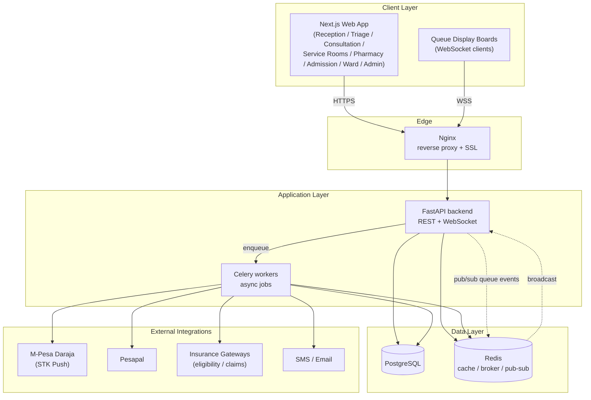
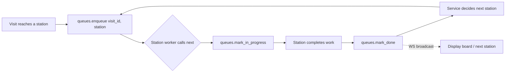
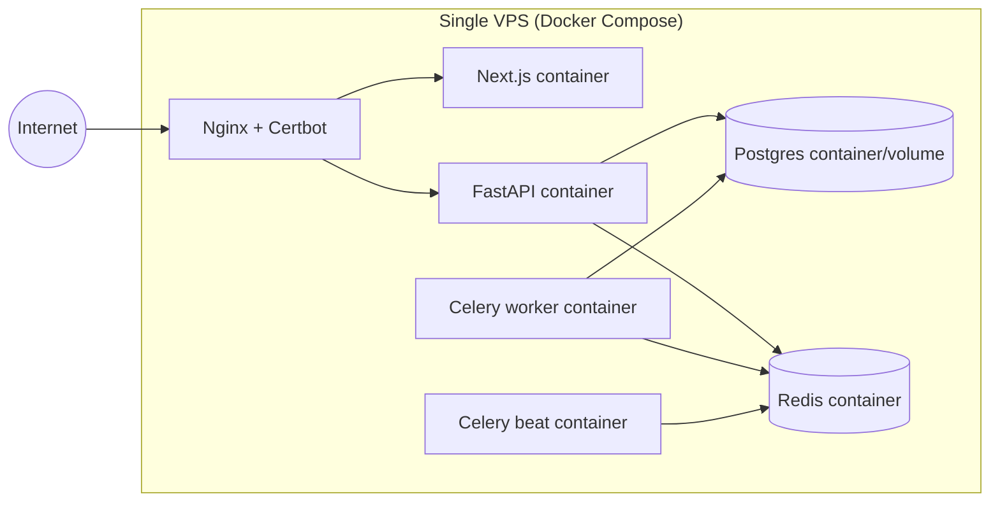

# System Architecture

## 1. High-Level Architecture

## 2. Why This Split

- **FastAPI over Flask**: async I/O matters here — STK Push callbacks, insurance
  eligibility checks, and queue-board WebSocket pushes are all I/O-bound and benefit
  from native `async`/`await` instead of blocking workers.
- **Next.js over plain React**: multiple distinct staff-facing surfaces (reception,
  triage, consultation, service rooms, pharmacy, admission, ward, admin) share auth
  and layout but are logically separate route groups — App Router route groups
  (`(reception)`, `(triage)`, …) fit this directly, plus server components reduce
  the payload on shared-workstation hospital PCs.
- **Celery + Redis**: M-Pesa/Pesapal callbacks and insurance claim submissions are
  retried, rate-limited, and sometimes slow (external API) — kept off the request/response
  path.
- **WebSockets for queues**: the source workflow has a queue in front of nearly every
  station (triage, consultation, service rooms, billing, pharmacy, admission,
  receiving nurse). Queue state changes need to reach the relevant station and the
  public display board in real time, so it is modeled as a first-class service, not
  an incidental DB flag.

## 3. Module → Service Mapping

| Module (from workflow) | Backend service | Key responsibilities |
|---|---|---|
| Patient Registration | `patients` | MRN issuance, demographics, insurance card capture |
| Billing | `billing` | Eligibility check, invoice/receipt, STK Push, co-pay logic |
| Triage | `triage` | Vitals capture, routes patient into Consultation Queue |
| Consultation | `consultations` | Doctor notes, session recording metadata, "book next room" |
| Service Rooms | `service_rooms` | Lab / Dental / Minor Theatre / Optical / Imagery sub-queues + results |
| Pharmacy | `pharmacy` | Outpatient & inpatient dispensing, stock deduction |
| Admission | `admissions` | Admission desk workflow, insurance pre-auth, bed assignment, receiving nurse intake |
| Ward Rounds | `ward_rounds` | Nurse vitals, doctor notes, optional specialist notes, loop into service rooms/inpatient pharmacy |
| Discharge | `discharge` | Discharge summary, final billing trigger |
| Queues (cross-cutting) | `queues` | Generic queue entries consumed by every module above; drives WebSocket board updates |

## 4. Queue Engine (Cross-Cutting)

Every station in the source diagram (Triage Queue, Consultation Queue, Service
Rooms Queue, Billing, Inpatient Pharmacy Queue, Admission Queue, Receiving Nurse
Queue) is an instance of the same underlying entity, not a bespoke table per
station:

This lets a single `queues` table + service drive routing for outpatient, service
rooms, and the whole admission/ward loop, instead of duplicating queue logic per
module.

## 5. Deployment

Mirrors the Dockerized deployment pattern already used on other Mobiclick Systems
projects — Nginx + Certbot for TLS, Postgres and Redis as long-lived volumes,
Celery worker/beat as separate containers so payment/insurance jobs don't compete
with API request handling.
