# Database Schema

PostgreSQL 16. Migrations via Alembic. All tables use UUID primary keys and
`created_at`/`updated_at` timestamps (omitted below for brevity).

## Entity-Relationship Diagram

```mermaid
erDiagram
    PATIENT ||--o{ VISIT : has
    PATIENT ||--o{ INSURANCE_POLICY : holds
    VISIT ||--o{ QUEUE_ENTRY : moves_through
    VISIT ||--o| VITALS : "triage/ward"
    VISIT ||--o{ CONSULTATION_NOTE : has
    VISIT ||--o{ SERVICE_ORDER : requests
    VISIT ||--o{ INVOICE : billed_via
    VISIT ||--o{ PRESCRIPTION : has
    VISIT ||--o| ADMISSION : may_have
    VISIT ||--o| DISCHARGE_SUMMARY : ends_with

    INVOICE ||--o{ INVOICE_LINE : contains
    INVOICE ||--o{ PAYMENT : settled_by
    INSURANCE_POLICY ||--o{ INSURANCE_CLAIM : generates
    INVOICE ||--o| INSURANCE_CLAIM : may_link

    SERVICE_ORDER }o--|| SERVICE_ROOM : routed_to
    SERVICE_ORDER ||--o| SERVICE_RESULT : produces

    PRESCRIPTION ||--o{ PRESCRIPTION_ITEM : contains
    PRESCRIPTION_ITEM }o--|| DRUG : references
    PRESCRIPTION_ITEM ||--o| DISPENSE_RECORD : dispensed_as

    ADMISSION }o--|| BED : occupies
    BED }o--|| WARD : belongs_to
    ADMISSION ||--o{ WARD_ROUND : has
    WARD_ROUND ||--o| VITALS : records
    WARD_ROUND ||--o| CONSULTATION_NOTE : records
    ADMISSION ||--o{ INSURANCE_PREAUTH : requires

    STAFF ||--o{ QUEUE_ENTRY : handles
    STAFF }o--|| ROLE : has
    QUEUE_ENTRY }o--|| STATION : at

    PATIENT {
        uuid id PK
        string mrn
        string full_name
        date dob
        string sex
        string phone
        string national_id
    }

    VISIT {
        uuid id PK
        uuid patient_id FK
        string visit_type "outpatient|admission"
        string status
        timestamp opened_at
        timestamp closed_at
    }

    QUEUE_ENTRY {
        uuid id PK
        uuid visit_id FK
        uuid station_id FK
        string status "waiting|in_progress|done"
        int position
        uuid assigned_staff_id FK
    }

    STATION {
        uuid id PK
        string name "triage|consultation|lab|dental|minor_theatre|optical|imagery|billing|inpatient_pharmacy|admission_desk|receiving_nurse"
    }

    VITALS {
        uuid id PK
        uuid visit_id FK
        float weight_kg
        float height_cm
        string blood_pressure
        float bmi
        text nursing_notes
    }

    CONSULTATION_NOTE {
        uuid id PK
        uuid visit_id FK
        uuid doctor_id FK
        text notes
        string recording_url
        uuid next_service_room_id FK
    }

    SERVICE_ROOM {
        uuid id PK
        string type "lab|dental|minor_theatre|optical|imagery"
        string name
    }

    SERVICE_ORDER {
        uuid id PK
        uuid visit_id FK
        uuid service_room_id FK
        uuid ordered_by_staff_id FK
        string status
    }

    SERVICE_RESULT {
        uuid id PK
        uuid service_order_id FK
        text result_notes
        string attachment_url
    }

    INSURANCE_POLICY {
        uuid id PK
        uuid patient_id FK
        string provider
        string member_number
        string status
    }

    INSURANCE_CLAIM {
        uuid id PK
        uuid policy_id FK
        uuid invoice_id FK
        string status "pending|submitted|approved|rejected"
        decimal claimed_amount
    }

    INSURANCE_PREAUTH {
        uuid id PK
        uuid admission_id FK
        string status
        text notes
    }

    INVOICE {
        uuid id PK
        uuid visit_id FK
        string payer_type "cash|insurance|co_pay"
        decimal total_amount
        string status "unpaid|paid|partially_paid"
    }

    INVOICE_LINE {
        uuid id PK
        uuid invoice_id FK
        string description
        decimal amount
    }

    PAYMENT {
        uuid id PK
        uuid invoice_id FK
        string method "mpesa|pesapal|cash|insurance"
        string reference
        decimal amount
        string status
    }

    PRESCRIPTION {
        uuid id PK
        uuid visit_id FK
        uuid prescribed_by_staff_id FK
        string type "outpatient|inpatient"
    }

    PRESCRIPTION_ITEM {
        uuid id PK
        uuid prescription_id FK
        uuid drug_id FK
        string dosage
        int quantity
    }

    DRUG {
        uuid id PK
        string name
        string form
        int stock_qty
    }

    DISPENSE_RECORD {
        uuid id PK
        uuid prescription_item_id FK
        uuid dispensed_by_staff_id FK
        timestamp dispensed_at
    }

    ADMISSION {
        uuid id PK
        uuid visit_id FK
        uuid bed_id FK
        uuid consultant_id FK
        string admission_approval_status
        text doctors_notes
        text investigation_notes
        timestamp admitted_at
        timestamp discharged_at
    }

    WARD {
        uuid id PK
        string name
    }

    BED {
        uuid id PK
        uuid ward_id FK
        string bed_number
        string status "free|occupied|cleaning"
    }

    WARD_ROUND {
        uuid id PK
        uuid admission_id FK
        uuid nurse_id FK
        uuid doctor_id FK
        uuid specialist_id FK "nullable"
        timestamp round_at
    }

    DISCHARGE_SUMMARY {
        uuid id PK
        uuid visit_id FK
        uuid admission_id FK
        text summary
        timestamp discharged_at
    }

    STAFF {
        uuid id PK
        string full_name
        uuid role_id FK
    }

    ROLE {
        uuid id PK
        string name "admin|receptionist|billing_clerk|triage_nurse|doctor|lab_tech|pharmacist|admission_officer|ward_nurse|consultant|records_officer"
    }
```

## Notes on Key Tables

- **`visit`** is the spine of the system: every clinical/financial record hangs off
  a visit, and `visit_type` distinguishes a same-day outpatient visit from one that
  escalates into an `admission`.
- **`queue_entry` + `station`** is the generic queue engine described in
  `ARCHITECTURE.md` §4 — every queue drawn in the source workflow (Triage Queue,
  Consultation Queue, Service Rooms Queue, Billing, Inpatient Pharmacy Queue,
  Admission Queue, Receiving Nurse Queue) is a `station` row, not a separate table.
- **`vitals`** is reused for both the outpatient Triage station and the inpatient
  Ward Round nurse capture — same shape (weight, height, BP, BMI, nursing notes) in
  both places in the source diagram.
- **`invoice.payer_type`** plus `payment.method` together model the Billing
  decision tree (insurance-eligible → invoice; cash → STK push/receipt; co-pay →
  partial insurance + cash).
- **`insurance_claim`** vs **`insurance_preauth`**: outpatient billing produces a
  claim against an invoice; admission produces a pre-authorization against the
  admission itself, matching the "ADMISSION APPROVAL" step at the Admission Desk.
- **`ward_round.specialist_id`** is nullable to reflect the "SPECIALIST /
  CONSULTANT (OPTIONAL)" box in the ward round workflow.
