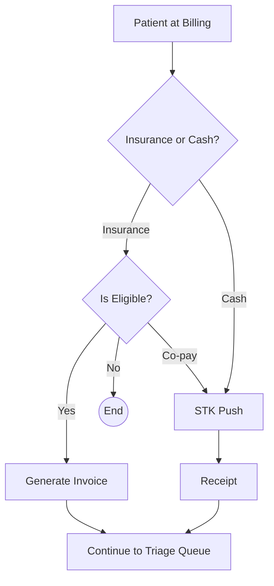
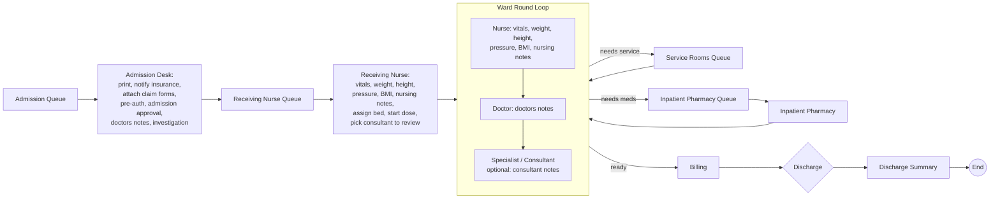

# Patient Workflows

Source: `HMIS-DATAFLOW.png` (patient dataflow whiteboard). This doc translates that
diagram into the sequence the system implements.

## 1. Outpatient Journey (Registration → Discharge)

```mermaid
flowchart LR
    Start((Start)) --> Reg[Patient Registration]
    Reg --> Billing{Billing:<br/>Cash / Insurance}
    Billing -->|Insurance, eligible| Invoice[Invoice]
    Billing -->|Insurance, not eligible| End1((End))
    Billing -->|Cash| STK[M-Pesa STK Push]
    Billing -->|Co-pay| STK
    STK --> Receipt[Receipt]
    Invoice --> TQ[Triage Queue]
    Receipt --> TQ
    TQ --> Triage[Triage: vitals, weight,<br/>height, pressure, BMI]
    Triage --> CQ[Consultation Queue]
    CQ --> Consult[Consultation Room:<br/>doctor notes, recording,<br/>book next room]
    Consult -->|needs service| SRQ[Service Rooms Queue]
    SRQ --> SR[Lab / Dental / Minor Theatre /<br/>Optical / Imagery]
    SR --> SRQ2[Service Rooms Queue]
    SRQ2 --> Billing2[Billing]
    Consult -->|no further service| Billing2
    Billing2 --> IPQ[Inpatient Pharmacy Queue]
    IPQ --> OPPharm[Outpatient Pharmacy]
    OPPharm --> End2((End))
```

**Key rule captured from the source diagram**: Billing sits *between* Consultation
and Pharmacy as well as before Triage — the system must support a visit revisiting
`billing` more than once (initial registration billing, then post-consultation
billing before pharmacy release).

## 2. Billing Decision Detail

Implemented by `billing.check_eligibility` (calls the insurance gateway
integration) then branches into `billing.create_invoice` or
`billing.initiate_stk_push` (M-Pesa Daraja).

## 3. Admission Journey

**Key rule**: the Ward Round Team is a loop, not a linear step — a patient can be
routed out to Service Rooms or Inpatient Pharmacy and back into the ward round
repeatedly until the consultant/doctor clears them for discharge. This maps to the
`ward_round` table plus repeated `queue_entry` rows against the `service_rooms` and
`inpatient_pharmacy` stations, all tied to the same `admission_id`.

## 4. Admission Desk Checklist (from sticky note)

The Admission Desk step bundles several sub-tasks that must each be trackable
independently (so admission can be blocked/unblocked on a specific item):

- [ ] Print admission documents
- [ ] Notify insurance
- [ ] Attach claim forms
- [ ] Admission pre-authorization
- [ ] Admission approval
- [ ] Doctor's notes
- [ ] Investigation

Modeled as an `admission_checklist_item` sub-table (or a JSONB checklist column on
`admission` if the list stays fixed) rather than free text, so the Admission Desk UI
can show real-time completion status before releasing the patient to the Receiving
Nurse Queue.

## 5. Queue Semantics Recap

Every arrow into a "…Queue" box in the source diagram is a `queues.enqueue()` call
against a specific `station`; every box that follows it is that station's worker
calling `queues.next()`. This single mechanism drives:

`Triage Queue → Consultation Queue → Service Rooms Queue → Billing → Inpatient
Pharmacy Queue → Admission Queue → Receiving Nurse Queue → Service Rooms Queue
(ward loop) → Inpatient Pharmacy Queue (ward loop)`

See `ARCHITECTURE.md` §4 for the engine design.
